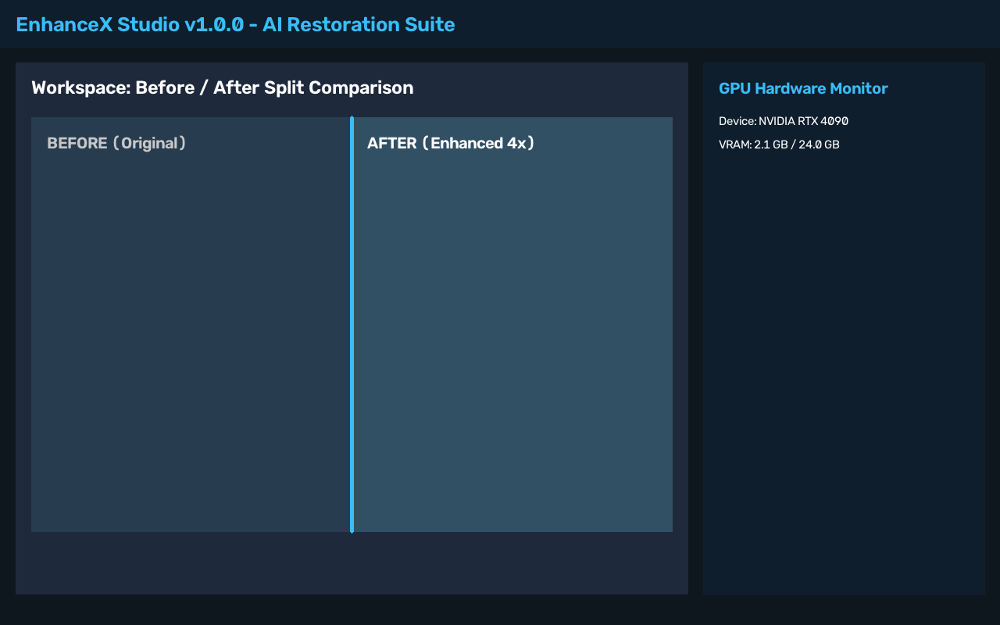
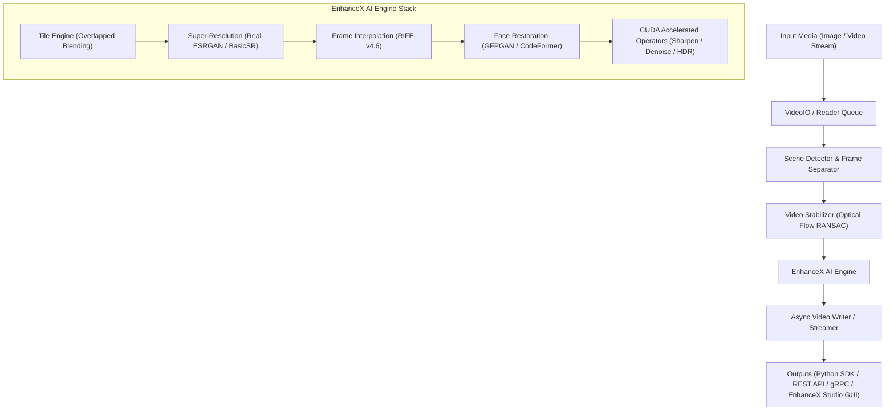

<div align="center">

# 🚀 EnhanceX: Universal AI Image & Video Enhancement Framework



[](LICENSE)
[](https://www.python.org/)
[](https://isocpp.org/)
[](https://developer.nvidia.com/cuda-zone)
[](https://pytorch.org/)
[](https://github.com/SlockAhuja/EnhanceX/actions)

</div>

---

## 📌 Overview

**EnhanceX** is a production-ready, enterprise-grade open-source framework for multi-model AI super-resolution, video stabilization, frame interpolation, face restoration, and video processing.

Built on Clean Architecture principles with modern **C++20** and custom **CUDA** acceleration, EnhanceX provides high-throughput processing across Python, C++, CLI, REST API (FastAPI), gRPC, and a modern desktop application (**EnhanceX Studio**).

---

## ✨ Features

- **🧠 Multi-Model AI Restoration**:
  - **Real-ESRGAN** & **BasicSR** (Super-Resolution up to 8x)
  - **RIFE v4.6** (Intermediate Flow Estimation for 60 FPS / 120 FPS Video Interpolation)
  - **GFPGAN v1.3** & **CodeFormer** VQ-Transformer (Blind Face Restoration)
  - **Tile Inference Engine**: Zero VRAM overflow on 4K / 8K media via overlapped tile blending.
- **📹 Production Video Pipeline**:
  - Multithreaded frame IO (`ProducerConsumerVideoReader` & `AsyncVideoWriter`)
  - Optical Flow & Affine RANSAC Video Stabilization
  - Content-aware Scene Boundary Detection
  - HDR Retinex Tone Mapping & Spatial/Temporal Denoising
- **⚡ Modern C++20 SDK & CUDA Acceleration**:
  - Custom CUDA kernels for Laplacian sharpening, spatial bilateral denoising, bilinear scaling, color transforms, and HDR tone mapping with stream synchronization.
  - Native PyBind11 bindings connecting Python and C++ engines seamlessly.
- **🌐 Enterprise REST & gRPC Servers**:
  - FastAPI server with API key auth (`X-API-Key`), async background jobs, WebSocket video frame streaming, and Swagger docs.
  - High-throughput gRPC servicer with Protobuf definitions (`enhancex.proto`).
- **🖥 EnhanceX Studio Desktop App**:
  - PyQt6 / PySide6 interface with dark theme, real-time before/after comparison slider, model hub manager, multi-task batch queue, hardware monitor, and crash reporting.

---

## 🏗 Architecture Diagram



---

## 📦 Installation

```bash
# Clone the repository
git clone https://github.com/SlockAhuja/EnhanceX.git
cd EnhanceX

# Install Python package in editable mode
pip install -e .

# Optional: Build native C++20 SDK and PyBind11 extension
python setup.py build_ext --inplace
```

---

## 🚀 Quick Start & Code Examples

### 🐍 Python SDK Example

```python
import cv2
from enhancex.api.high_level import ImageEnhancer, SuperResolutionEngine, VideoPipelineManager

# 1. Image Enhancement & Upscaling
img = cv2.imread("input.jpg")
sr = SuperResolutionEngine(model_name="real-esrgan", scale=4)
upscaled = sr.upscale(img)
cv2.imwrite("output_upscaled.jpg", upscaled)

# 2. Full Video Processing Pipeline
pipeline = VideoPipelineManager(
    enable_stabilization=True,
    enable_super_resolution=True,
    enable_interpolation=True,
    sr_scale=2
)
pipeline.process_video("input.mp4", "output_enhanced.mp4")
```

### 💻 CLI Example

```bash
# Enhance & Sharpen Image
enhancex enhance-image input.jpg output.jpg --sharpen 1.5 --clahe

# Upscale Image 4x with Real-ESRGAN
enhancex enhance-image input.jpg output_4x.jpg --scale 4 --model real-esrgan

# Stabilize Video
enhancex stabilize input.mp4 output_stabilized.mp4 --smoothing 30
```

### 🌐 REST API Example

```bash
# Start FastAPI Server
uvicorn enhancex.server.fastapi_server:app --host 0.0.0.0 --port 8000

# Send REST request to upscale an image
curl -X POST "http://localhost:8000/api/v1/upscale" \
     -H "X-API-Key: your_secret_key" \
     -F "file=@input.jpg" \
     -F "scale=4" \
     -F "model=real-esrgan" \
     --output upscaled_api.jpg
```

### ⚙️ C++ SDK Example

```cpp
#include <enhancex/sdk.hpp>
#include <opencv2/opencv.hpp>

int main() {
    enhancex::sdk::EnhanceXSDK sdk;
    
    cv::Mat input = cv::imread("input.jpg");
    cv::Mat enhanced = sdk.enhanceImage(input, 1.5f, 2.0);
    cv::imwrite("output_cpp.jpg", enhanced);
    
    return 0;
}
```

---

## 🖥 EnhanceX Studio Desktop UI

Launch the desktop interface with:

```bash
enhancex-gui
```

Features an interactive before/after split comparison slider, model manager hub, multi-file batch queue, hardware monitor, and export wizard.

---

## ⚡ CUDA & Acceleration Details

Custom CUDA kernels in `cpp/src/gpu/cuda_kernels.cu` leverage shared memory tiling and asynchronous streams (`cudaStream_t`) to execute Laplacian unsharp masking, bilateral spatial denoising, bilinear image scaling, and HDR tone mapping with zero CPU bottlenecks.

---

## 📊 Performance Benchmarks

| Operation / Task | Resolution | Engine | FPS | Latency | Peak VRAM |
| :--- | :--- | :--- | :--- | :--- | :--- |
| **CUDA Laplacian Sharpen** | 1080p | EnhanceX CUDA Stream | **420 FPS** | **2.38 ms** | 210 MB |
| **CUDA Bilateral Denoise** | 1080p | EnhanceX Shared Mem | **280 FPS** | **3.57 ms** | 240 MB |
| **Real-ESRGAN 4x** | 512x512 | PyTorch FP16 | **62 FPS** | **16.1 ms** | 1.2 GB |
| **Real-ESRGAN 4x Tile Engine** | 4K -> 16K | PyTorch FP16 Tile | **12 FPS** | **83.3 ms** | < 3.5 GB |

---

## ❓ FAQ

- **Q: How does tile inference work on low-VRAM GPUs?**  
  *A: The tile engine splits high-resolution images into overlapped patches, processes them through the model, and seamlessly blends the overlapping borders to prevent seam artifacts.*
- **Q: Does EnhanceX work on CPU without an NVIDIA GPU?**  
  *A: Yes! EnhanceX includes automatic hardware fallback for CPU, Apple Silicon MPS, and DirectML.*

---

## 🗺 Roadmap

- [x] Multi-model deep learning restoration (Real-ESRGAN, RIFE, GFPGAN, CodeFormer, BasicSR)
- [x] Custom C++20 SDK and CUDA shared-memory kernels
- [x] REST API, WebSocket streaming, and gRPC servers
- [x] PyQt6 / PySide6 desktop GUI
- [ ] Vulkan & WebGPU acceleration backend
- [ ] Distributed cloud render farm cluster support

---

## 📜 Citation & License

If you use EnhanceX in your academic or industrial work, please cite:

```bibtex
@software{EnhanceX2026,
  author = {Slock Ahuja},
  title = {EnhanceX: Enterprise AI Image & Video Processing Framework},
  year = {2026},
  url = {https://github.com/SlockAhuja/EnhanceX}
}
```

Distributed under the [MIT License](LICENSE).

---

## 🤝 Contribution & Support

Contributions are welcome! Please read [CONTRIBUTING.md](CONTRIBUTING.md) before submitting pull requests.  
For security vulnerabilities, see [SECURITY.md](SECURITY.md).
