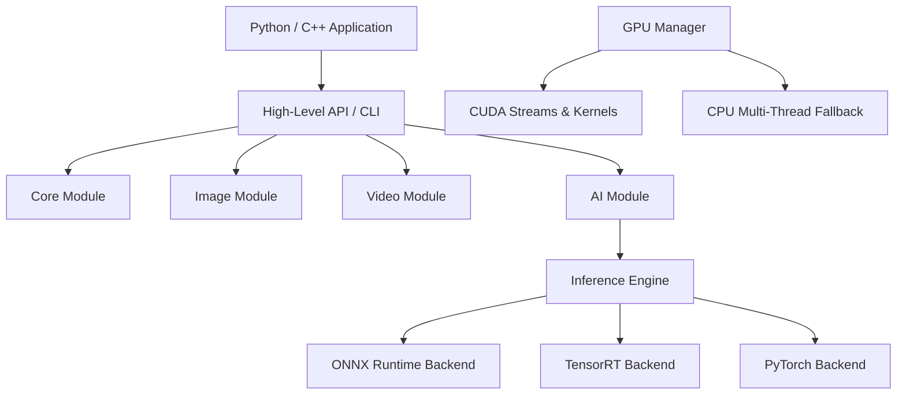

# EnhanceX Architecture Specification

## Overview

EnhanceX is designed as a hybrid C++20 and Python framework. The engine is divided into cleanly decoupled modules with strict boundaries.

## Module System

1. **Core Module (`enhancex.core`)**
   - ConfigManager: Manages system execution modes, precision, threads.
   - Logger: Standardized console and file loggers with ANSI color codes.
   - TaskScheduler: Multi-threaded batch frame processing queue.
   - MemoryCache: LRU cache for frame buffers and tensor weights.

2. **GPU Module (`enhancex.gpu`)**
   - GPUManager: Manages CUDA devices, memory allocations, streams, and automatic CPU fallbacks.

3. **Image Module (`enhancex.image`)**
   - Resize: Bicubic, Lanczos, Bilinear.
   - Sharpen: Unsharp Mask and Laplacian filters.
   - Denoise: FastNLMeans, Bilateral, Gaussian filters.
   - Color: CLAHE, Histogram Equalization, Gray-World / White-Patch White Balance.

4. **Video Module (`enhancex.video`)**
   - VideoReader / VideoWriter: High performance frame I/O wrappers.
   - VideoStabilizer: Optical Flow tracking (Lucas-Kanade) + RANSAC homography motion estimation + Savitzky-Golay trajectory smoothing + border warping + rolling shutter artifact reduction.
   - Scene Detection: Histogram-based step detection.
   - Video Trimming.

5. **AI Module (`enhancex.ai`)**
   - InferenceEngine: Dynamic dispatch across ONNX Runtime, TensorRT, PyTorch, and Fallback algorithms.
   - SuperResolutionEngine: Real-ESRGAN, EDSR, SRCNN tile-based neural inference (handles 4K/8K media without GPU OOM).
   - FrameInterpolatorEngine: RIFE neural optical-flow frame interpolation.
   - AIDenoiseEngine, FaceEnhancer, HDREnhancer.
